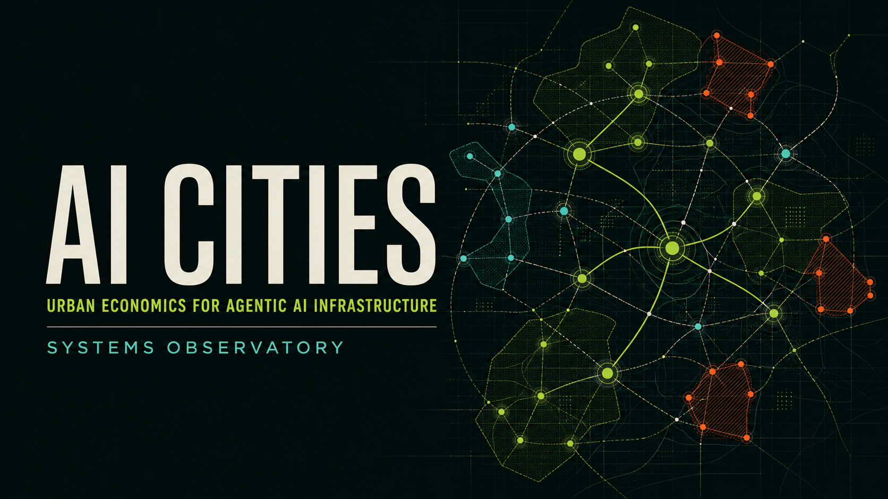

# AI Cities

**Urban economics for agentic AI infrastructure.**

[](https://github.com/cipherholdingsllc/ai-cities/actions/workflows/quality.yml)

> AI systems are becoming environments, not tools; environments need civic architecture.



AI Cities is a math-first framework for reasoning about congestion, behavioral spillovers, scarce context, memory pollution, verification burden, and delegated autonomy in shared agentic systems. The Systems Observatory turns the public framework into a read-only, interactive research interface.

## Status and claim boundary

| Surface | Status | What that means |
| --- | --- | --- |
| Public framework | **v0.1.0 · current canon** | Five initial models, four framework modules, examples, diagrams, and templates |
| Canonical roadmap | **0.2 working draft** | Proposed research extensions and validation gates; not a framework release |
| Systems Observatory | **interface preview** | Static, client-side GUI using synthetic demonstration values |
| Empirical validation | **not complete** | No live telemetry, causal result, validated health score, or control plane is claimed |

The city metaphor is a design aid, not a literal equivalence. Software actors receive delegated permissions; human owners remain accountable.

## Explore the system

The interface has three connected surfaces:

- **City map** — actors, resource substrate, governance, memory, and system signals with source, freshness, confidence, risk zone, and truth-state disclosure.
- **Model lab** — live, deterministic calculators for all five canonical models.
- **Evidence ledger** — the complete 23-element ontology, 25-variable mathematical register, baseline metric profile, econometric evaluation contract, and Gates 0–10.

```bash
npm ci
npm run dev
```

The production gate is one command:

```bash
npm run check
```

It runs the formatter/linter, domain and data-integrity tests, strict TypeScript checking, and the release build.

## Mathematical spine

| Model | Question | Canonical form |
| --- | --- | --- |
| [Congestion Externality](models/01-congestion-externality.md) | What spillover does one more user impose on a shared substrate? | `TCₛ(q) = q · cₛ(q)` and `MECₛ(q) = q · c′ₛ(q)` |
| [Behavioral Externality Multiplier](models/02-behavioral-externality-multiplier.md) | How large is downstream cost relative to cheap execution? | `BEMᵢ,ₕ = Dᵢ,ₕ / Iᵢ` |
| [Agentic Leverage](models/03-agentic-leverage.md) | Does verified value exceed total system friction? | `ALₕ = V✓ₕ / (Cexec + Ccoord + Cctx + Cverify + Crework + Crisk)` |
| [Risk-Adjusted Autonomy](models/04-risk-adjusted-autonomy.md) | How should risk bound delegated authority? | `A*ᵢ = min(1, KᵢTᵢRᵢ / (Xᵢ + ε))` |
| [Context Allocation](models/05-context-allocation.md) | Which information deserves scarce active attention? | `max Σxⱼ(uⱼ − nⱼ)`, subject to `Σxⱼsⱼ ≤ K` |

These are working formalizations, not settled laws. Serious use requires declared units, observable proxies, an evaluation boundary, uncertainty treatment, and a falsification condition.

## Human city → AI system

| Urban element | Agentic-system analogue |
| --- | --- |
| Roads and transit | APIs, queues, dependencies, handoffs, and retrieval paths |
| Land and centrality | Context, memory, compute, attention, and human review capacity |
| Zoning | Permission boundaries and graduated autonomy |
| Inspectors | Tests, evaluations, reviewers, and source checks |
| Public records | Receipts, logs, provenance, decisions, and audit trails |
| Pollution | Hallucinations, stale context, conflicts, misinformation, and cleanup cost |
| Congestion | Queue pressure, latency, coordination load, and verification bottlenecks |
| Emergency services | Rollback, quarantine, escalation, incident response, and restoration |
| Quality of life | Trust, usability, reliability, cognitive burden, and operator confidence |

See the [Concept Map](docs/01-concept-map.md) and [canonical ontology](docs/05-canonical-origin-evolution-and-roadmap.md#5-bounded-city-ontology) for the full translation.

## Research discipline

The framework separates four truth states:

1. **Current public canon** — defined by the v0.1.0 baseline.
2. **Working extension** — doctrine proposed for review.
3. **Proposed experiment** — a testable direction, not a measured result.
4. **Long-range concept** — product direction gated on earlier evidence.

An evaluation must name its unit of analysis, treatment, outcome and proxy, horizon, counterfactual, confounders, interference, uncertainty, missing-data behavior, and rejection condition. Dashboard correlations do not establish causation.

## Repository map

```text
src/
├── data/       Public-safe ontology, metrics, variables, gates, and synthetic map
├── domain/     Pure typed model functions and tests
└── ui/         Semantic interface template and interaction controllers
models/         Five canonical mathematical models
frameworks/     Risk zoning, memory, subsystems, and VIGIL safeguards
docs/           Thesis, concept map, limitations, roadmap, and engineering notes
examples/       Healthcare and developer-tools applications
simulation/     Validation metrics and simulation direction
templates/      Agentic-system audit and risk-zone worksheets
```

The GUI deliberately has no framework runtime, backend, analytics, authentication, storage, or live agent connection. That keeps the public trust boundary small and makes every calculation reproducible. See [Interface and Engineering Notes](docs/06-interface-engineering.md).

## Reading paths

- **Researcher:** [Thesis](docs/00-thesis.md) → [Models](models/) → [Sources](SOURCES.md) → [Limitations](docs/04-limitations.md)
- **Builder:** [Civic Agent Stack](docs/03-civic-agent-stack.md) → [Risk Zoning](frameworks/risk-zoning.md) → [System Audit](templates/agentic-system-audit.md)
- **Strategy:** [Canonical Origin, Evolution, and Roadmap](docs/05-canonical-origin-evolution-and-roadmap.md)
- **Contributor:** [Contributing](CONTRIBUTING.md) → [Engineering Notes](docs/06-interface-engineering.md) → `npm run check`

## Non-goals

AI Cities is not a production control plane, employee-ranking system, universal “city health” score, or claim of empirical proof. The public repository must not contain private operating data or destructive action surfaces. Observation precedes control; any future intervention requires preview, explicit approval, durable evidence, reversibility, and tested recovery.

## Sources and license

The primary urban-economics foundation is Jan Brueckner’s *Lectures on Urban Economics*. Adjacent sources and research gaps are tracked in [SOURCES.md](SOURCES.md). Licensed under the [MIT License](LICENSE).
