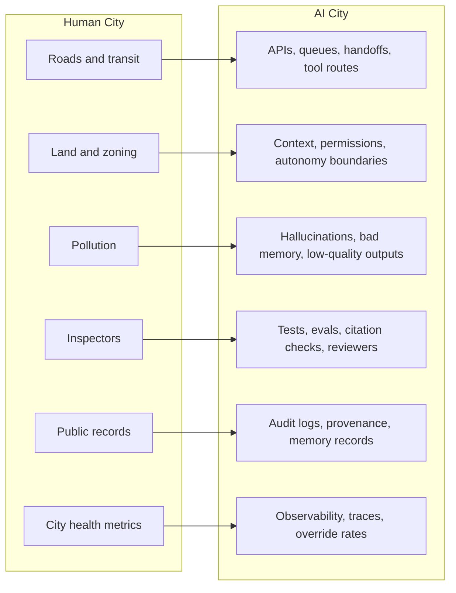
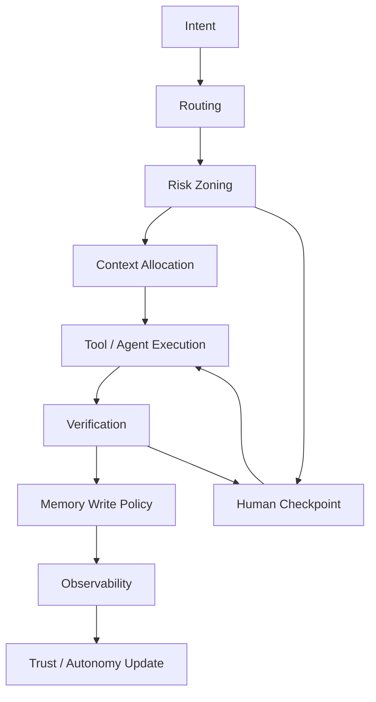

# AI Cities

**Urban economics for agentic AI infrastructure.**

> AI systems are becoming environments, not tools; environments need civic architecture.

## Status

**Status:** Working framework  
**Version:** v0.1.0  
**Scope:** Public design framework, not an implementation or simulator.

## Why this exists

As agents, tools, memory, APIs, humans, and verification loops interact inside shared AI systems, they begin to produce city-like dynamics: congestion, behavioral spillovers, memory pollution, security risk, and coordination costs.

AI Cities is a math-first framework for reasoning about those dynamics. It borrows from urban economics – especially congestion, externalities, land scarcity, public goods, and safeguards – and translates those ideas into agentic AI architecture.

The claim is not that AI systems are literally cities. The goal is to build a practical design lens for systems where local agent actions can create system-level consequences.

## What this is / what this is not

This is a compact public framework for modeling externalities in agentic AI systems.

It is not an SDK, package, runtime, simulator, prompt pack, or production implementation.

## Human City → AI City



## Mathematical spine

Three metrics anchor the framework:

**Behavioral Externality Multiplier**

```text
BEM_{i,H} = D_{i,H} / I_i
```

Measures how much downstream cost an AI action creates relative to its initial execution cost.

**Agentic Leverage**

```text
AL_H = V^✓_H / (C_exec + C_coord + C_ctx + C_verify + C_rework + C_risk)
```

Measures verified value per unit of total system friction.

**Risk-Adjusted Autonomy**

```text
A*_i = min(1, (K_i · T_i · R_i) / (X_i + ε))
```

Argues that capability alone should not determine autonomy. Trust, reversibility, and externality risk matter.

## Civic Agent Stack



## Core models

1. [Congestion Externality](models/01-congestion-externality.md) – resource contention in shared substrates
2. [Behavioral Externality Multiplier](models/02-behavioral-externality-multiplier.md) – downstream cost amplification
3. [Agentic Leverage](models/03-agentic-leverage.md) – verified value over system friction
4. [Risk-Adjusted Autonomy](models/04-risk-adjusted-autonomy.md) – autonomy bounded by risk and reversibility
5. [Context Allocation](models/05-context-allocation.md) – scarce context as allocation problem

## Frameworks

* [AI City Subsystems](frameworks/ai-city-subsystems.md) – civic primitives for agentic environments
* [Risk Zoning](frameworks/risk-zoning.md) – permission and autonomy boundaries
* [Memory Records and Maps](frameworks/memory-records-and-maps.md) – knowledge, provenance, and graph memory
* [Verification and Civic Safeguards](frameworks/verification-and-civic-safeguards.md) – VIGIL as an operational safety loop

## Reading paths

**Investor:** README → [Thesis](docs/00-thesis.md) → [BEM](models/02-behavioral-externality-multiplier.md) → [Healthcare example](examples/healthcare-ai-city.md)

**Builder:** [Civic Agent Stack](docs/03-civic-agent-stack.md) → [Risk Zoning](frameworks/risk-zoning.md) → [Agentic System Audit](templates/agentic-system-audit.md)

**Researcher:** [Thesis](docs/00-thesis.md) → [Models](models/) → [Sources](SOURCES.md) → [Limitations](docs/04-limitations.md)

## Examples

* [Healthcare AI City](examples/healthcare-ai-city.md) – high-stakes decisions, provenance, and human review
* [Developer Tools AI City](examples/developer-tools-ai-city.md) – code agents, tests, repos, and review loops

## Simulation roadmap

AI Cities borrows AI Town’s legibility, not its aesthetic.

v0.1 includes no simulator. Future work may explore abstract dashboards and district maps for congestion load, verification burden, memory integrity, autonomy zones, externality burden, and override rates.

## Sources

Primary foundation: Jan Brueckner’s *Lectures on Urban Economics*.

Adjacent references to evaluate include Alain Bertaud’s *Order Without Design*, Edward Glaeser’s *Triumph of the City*, Software 3.0 / LLM-as-computer framing, Generative Agents, AI Town, agent frameworks, and AI governance/security sources.

See [SOURCES.md](SOURCES.md).

## License

See [LICENSE](LICENSE).

